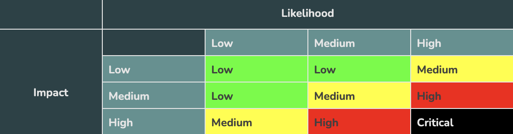

# Hardhat Security

- [Hardhat Security](#hardhat-security)
- [What is an Audit?](#what-is-an-audit)
- [Help your auditors!](#help-your-auditors)
- [Process](#process)
- [Resources](#resources)
  - [Tools](#tools)
  - [Games](#games)
  - [Blogs](#blogs)
  - [Audit Examples:](#audit-examples)
  - [Articles](#articles)
- [Getting Started](#getting-started)
  - [Requirements](#requirements)
  - [Quickstart](#quickstart)
  - [No Typescript Support](#no-typescript-support)
    - [Optional Gitpod](#optional-gitpod)
- [Usage](#usage)
  - [Slither](#slither)
  - [Echidna](#echidna)
- [Linting](#linting)
- [Formatting](#formatting)
- [Thank you!](#thank-you)

# What is an Audit?

An audit is a security focused code review for looking for issues with your code.

# Help your auditors!

When writing good code, you 100% need to follow these before sending you code to an audit.

[Tweet from legendary security expert Tincho](https://twitter.com/tinchoabbate/status/1400170232904400897)

- Add comments
  - This will help your auditors understand what you're doing.
- Use [natspec](https://docs.soliditylang.org/en/v0.8.11/natspec-format.html)
  - Document your functions. DOCUMENT YOUR FUNCTIONS.
- Test
  - If you don't have tests, and test coverage of all your functions and lines of code, you shouldn't go to audit. If your tests don't pass, don't go to audit.
- Be ready to talk to your auditors
  - The more communication, the better.
- Be prepared to give them plenty of time.
  - They literally pour themselves over your code.

> "At this time, there are 0 good auditors that can get you an audit in under a week. If an auditor says they can do it in that time frame, they are either doing you a favor or they are shit. " - Patrick Collins, March 4th, 2022

# Process

An auditors process looks like this:

1. Run tests
2. Read specs/docs
3. Run fast tools (like slither, linters, static analysis, etc)
   Static analysis is just us running some program to read over al our codes to find out some commonly known bugs and one of the tools used for this is slither which we are going to use for this project
4. Manual Analysis
5. Run slow tools (like echidna, manticore, symbolic execution, MythX)
6. Discuss (and repeat steps as needed)
7. Write report ([Example report](https://github.com/transmissions11/solmate/tree/main/audits))

Typically, you organize reports in a chart that looks like this:



# Resources

These are some of the best places to learn even MORE about security:

PRs welcome to improve the list.

## Tools

- [Slither](https://github.com/crytic/slither)
  - Static analysis from Trail of Bits.
- [Echidna](https://github.com/crytic/echidna)
  - Fuzzing from Trail of Bits.
- [Manticore](https://github.com/trailofbits/manticore)
  - Symbolic execution tool from Trail of Bits.
- [MythX](https://mythx.io/)
  - Paid service for smart contract security.
- [Mythrill](https://github.com/ConsenSys/mythril)
  - MythX free edition.
- [ETH Security Toolbox](https://github.com/trailofbits/eth-security-toolbox)
  - Script to create docker containers configured with Trail of Bits security tools.
- [ethersplay](https://github.com/crytic/ethersplay)
  - ETH Disassembler
- [Consensys Security Tools](https://consensys.net/diligence/tools/)
  - A list of Consensys tools.

## Games

- [Ethernaut](https://ethernaut.openzeppelin.com/) (This is a must play!)
- [Damn Vulnerable Defi](https://www.damnvulnerabledefi.xyz/) (This is a must play!)

## Blogs

- [rekt](https://rekt.news/)
  - A blog that keeps up with all the "best" hacks in the industry.
- [Trail of bits blog](https://blog.trailofbits.com/)
  - Learn from one of the best auditors in the space.
- [Openzeppelin Blog](https://blog.openzeppelin.com/)
  - Another blog of one of the best auditors in the space.

## Audit Examples:

- [Openzeppelin](https://blog.openzeppelin.com/fei-audit-2/)
- [Sigma Prime](https://tracer.finance/radar/sigma-prime-audit/)
- [Trail of Bits](https://alephzero.org/blog/trail-of-bits-audit-security/)

## Articles

- [Smart Contract Security Best Practices](https://consensys.github.io/smart-contract-best-practices/)
  - Consensys blog on security vulnerabilities. Also [check out their tools.](https://consensys.net/diligence/tools/)
- [Chainlink X Certik Blog on Security](https://www.certik.com/resources/blog/technology/top-10-defi-security-best-practices)
  - I helped write this. 😊
- [More attacks](https://consensys.github.io/smart-contract-best-practices/attacks/denial-of-service/)

# Getting Started

## Requirements

- [Git](https://git-scm.com/book/en/v2/Getting-Started-Installing-Git)
  - You'll know you did it right if you can run `git --version` and you see a response like `git version x.x.x`
- [Nodejs](https://nodejs.org/en/)
  - You'll know you've installed nodejs right if you can run:
    - `node --version` and get an ouput like: `vx.x.x`
- [Yarn](https://classic.yarnpkg.com/lang/en/docs/install/) instead of `npm`
  - You'll know you've installed yarn right if you can run:
    - `yarn --version` and get an output like: `x.x.x`
    - You might need to install it with npm
- [Docker](https://docs.docker.com/get-docker/)
  - You'll know you've installed docker right if you can run:
  - `docker --version` and get an ouput like `Docker version xx.xx.xx, build xxxxx`

## Quickstart

```
git clone https://github.com/PatrickAlphaC/hardhat-security-fcc
cd hardhat-security-fcc
yarn
```

Then, go right into [usage](#usage)

# Usage

## Slither

Open the docker shell:

```
yarn toolbox
```

Then, run:

```
slither /src/contracts/ --solc-remaps @openzeppelin=/src/node_modules/@openzeppelin --exclude naming-convention,external-function,low-level-calls
```

To exit:

```
exit
```

## Echidna

Open the docker shell:

```
yarn toolbox
```

Then, run this:

```
echidna-test /src/contracts/test/fuzzing/VaultFuzzTest.sol --contract VaultFuzzTest --config /src/contracts/test/fuzzing/config.yaml
```

To exit:

```
exit
```

# Linting

To check linting / code formatting:

```
yarn lint
```

or, to fix:

```
yarn lint:fix
```

# Formatting

```
yarn format
```

# Thank you!

If you appreciated this, feel free to follow me and Patrick Collins, big ups to him for the help on most of the stuffs in the repo

This project is more about explanation and rather codes
For example the reentrancy attack where we first send the users their money before updating the balance, THIS IS NEVER TO BE DONE, so when we are done creating our contracts we send it to auditors to help us check not just reenrtrancy attacks but anything that might be wrong with our code. And auditors are also humans, this just means that even if your codes get audited it doesn't mean that you are bug free.
Also there is an auditor guide of openzeppelin, under which a lot of tips are given on how to create an auditing request and also about documenting functions

On this project we already have different contracts with some vulnerabilities which we have to fix
The most common attacks are reentrancy and oracle manipulation
To get started we use slither, to get started with slither we need to use python, pip3 and solc-select so we install all this and chose which solc we want for our solidity version then we install the slither analyser and we add it to our python environment
Then we run the slither command after whih we get a massive output with some red and some green, the way we can read slither, it lists out a number of line that have issues and a reference to that issue, so if we have a red line on screen it means that there is a high impact issue at point that should be addressed, we can see it catches our metamorphic contract aad it catches the issue about how someone can own our contract and kill it.
For the greens it's just more of like a sugestion like an a dvidce to make a variable a constant since it never changes or if you're using different versions of solidity.
Also here the reentrancy issue is being caught, but it didn't catch the other issues from the other contracts which is why we are advised not to rely on slither alone
Fuzzing and Ethereum-security tool box
This is under the manual analysis where we can use a tool like Echidna, so since we know that different people are going to be interacting with our code in different ways we need to prepare for this which is why we create this test and our fuzing test is in solidity this time around and not javascript
So this is exactly what we are doing for the vault contrsct passing in our password to see if it fails. so we use echidna to do this test, to do that we would need to install echidna or we can just install the ethereum-security-tools which we need to install from docker, so after docker is installed we can then run some docker command, which we've already created a script for
So docker test already has most of these tests like echidna test installed so to run echidna we just run on our terminal the below code
echidna-test /src/contracts/test/fuzzing/VaultFuzzTest.sol --contract VaultFuzzTest --config /src/contracts/test/fuzzing/config.yaml
And in seconds we can see that it found a password for our vault and a case where it can set state to

Closing security thoughts
Always run slither and look manually for reentrancy attacks or manaul oracle manipulation
So after running through all the steps and making sure the code is secure, run through the process one more time and make sure that everything is okay and then discuss findings with the auditors, then afterwards write a report for findings
So you can check rekt.com about all the hacks that's happened and then we can then learn on how to stop this from happening in the future.
